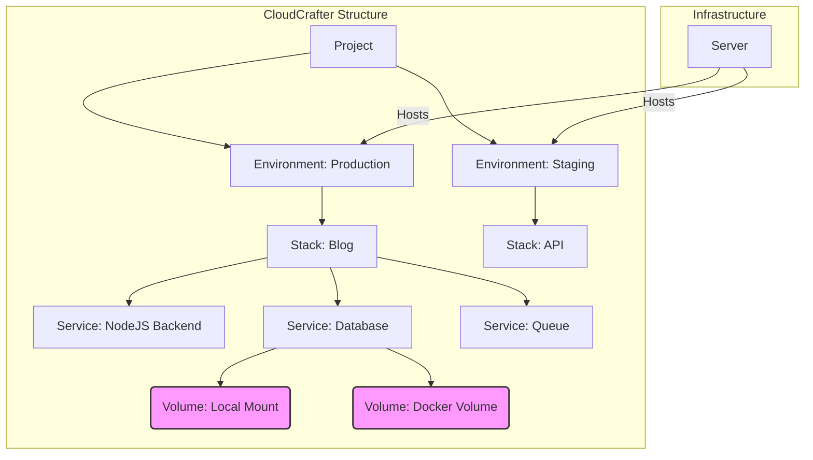

## Conceptual entities

There are several aspects in CloudCrafter that are important to understand. The User-Interface should be straight forward, but it is still important to understand the underlying concepts.

### Servers

You can add a server to CloudCrafter by going to the servers-page and clicking the "Add server" button. CloudCrafter will then allow that server to create a connection by the CloudCrafter Agent. 
More information about the CloudCrafter Agent can be found [here](/docs/cloudcrafter).

### Projects

You can add as many projects as you want to CloudCrafter. See a project a "set" of something you would like to deploy. For example, if you would like to deploy an app that requires multiple services (for instance: redis, database),
you can name the project "My Application".

A project contains Environments. When you create a project, CloudCrafter will create a default environment called "Production". Within a project, you can create multiple environments. 
You can also rename environments - they are purely cosmetical and will not affect the deployment process.

### Environments

As described above, an environment belongs to a project. You can rename environments - they are purely cosmetical and will not affect the deployment process. An environment contains Stacks - you can add
as many stacks as you want to an environment.

### Stacks

A stack is a collection of services that are used to deploy an application. A great example of a stack would be a "Blog" stack, which contains all the services that are needed to deploy a blog. A blog typically consists of a backend
(for example: a Node.js application), a database and a queue. You can add all these services to the stack and will be deployed together.

### Services

A service is a single component of a stack. A Node.js application is a service, a database is a service and a queue is also a service. 

#### Volumes

Volumes are a way to persist data outside of the container. This is useful for databases, but also for other services. 

<Callout title="Types of Volumes">

There are two types of volumes:

- Local mount
- Traditional Docker Volume

#### Local mount [!toc]

A local mount will mount a directory from the server to the service. 

#### Docker Volume [!toc]

A Docker Volume is a volume that is managed by Docker. It will show up if you run `docker volume ls` on the server.
</Callout>

#### Environment Variables

Environment variables are a way to pass environment variables to the services. They are useful for passing secrets, API keys and other sensitive information.
<Callout title="Types of Environment Variables">

There are three types of environment variables:

- Runtime
- Buildtime
- Runtime & Buildtime

#### Runtime [!toc]

A runtime environment variable will be available at runtime.

#### Buildtime [!toc]

A buildtime environment variable will be available at buildtime.

#### Runtime & Buildtime [!toc]

A runtime & buildtime environment variable will be available at runtime and buildtime.
</Callout>

# Current feature state and wishes

TODO: Link to the correct page.

## Schematic

