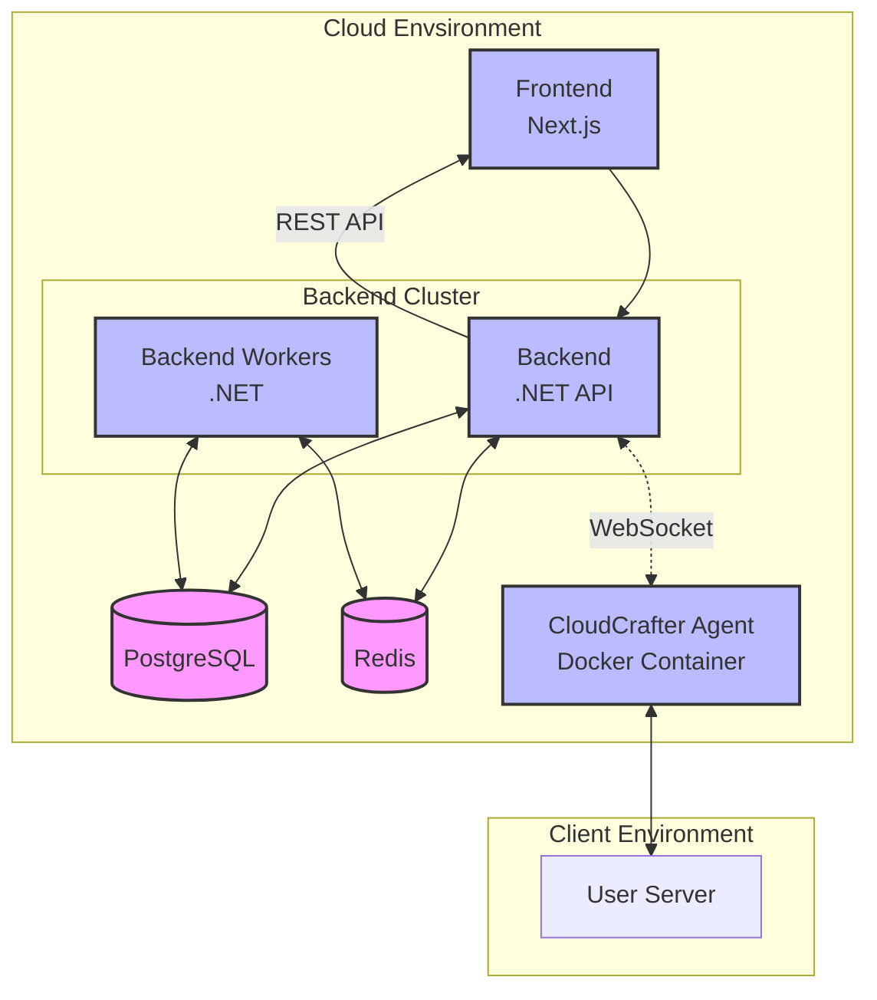

Welcome to the documentation for CloudCrafter! Please note that this project is still under development and not all features are available.
While it is under heavy development, the documentation is not yet complete. 

# What is the goal of CloudCrafter?

The goal of CloudCrafter is to provide a platform for deploying and managing cloud-based applications. Wether it is a monorepo application that you create or one 
of the one-click applications that we provide, CloudCrafter will help you manage it. It is very much in line with existing solutions like [Vercel](https://vercel.com/?ref=cloudcrafter) / [Netlify](https://netlify.com/?ref=cloudcrafter) / [Heroku](https://heroku.com/?ref=cloudcrafter) / [Coolify](https://coolify.io/?ref=cloudcrafter) / [Dokploy](https://dokploy.com/?ref=cloudcrafter).

# How does it work?

Basically, CloudCrafter consists of the following parts:

- **Backend**: The backend is a .NET application that is responsible for managing the applications. It is responsible for deploying the applications, managing the databases, and providing a REST API and Websocket connections. This backend is also scalable.
- **Backend Workers**: The Backend Workers is the same application as the Backend, but it is deployed as a set of workers. These workers are scalable and will handle heavy background-jobs.
- **Frontend**: The Frontend is a Next.js application that is responsible for providing a web interface for the user. It will connect to the Backend via the REST API.
- **CloudCrafter Agent**: The CloudCrafter Agent is a Docker image that runs on your machine. It will connect via WebSockets to the backend and allows communication between the backend and your server. No more passing around of SSH-keys, just run the Docker image and you're all set!
- **PostgreSQL**: We use PostgreSQL as our database. The Backend and the Backend Workers are connected to the same database.
- **Redis**: We use Redis as our cache, and our backing queue for the background workers.

```js title="Title"
console.log('Hello');
```



